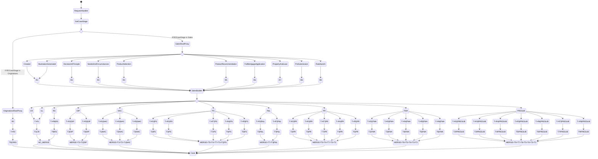

```mermaid
stateDiagram
    
    [*] --> RequestHandler
    RequestHandler --> GetCaseStage        
    GetCaseStage
    state sales_or_originations <<choice>>
    GetCaseStage --> sales_or_originations
    sales_or_originations --> SalesRootProxy: if RDCaseStage is Sales
    sales_or_originations --> OriginationsRootProxy: if RDCaseStage is Originations
    OriginationsRootProxy --> R0
    R0 --> T>R0
    T>R0 --> T0|ORIG
    T0|ORIG --> Case
    state sales_stage <<choice>>
    SalesRootProxy --> sales_stage
    sales_stage --> Created
    sales_stage --> IllustrationGenerated
    sales_stage --> DecisionInPrinciple
    sales_stage --> NeedsAndCircumstances
    sales_stage --> ProductSelection
    sales_stage --> ProductRecommendation
    sales_stage --> FullMortgageApplication
    sales_stage --> PropertyAndLoan
    sales_stage --> PreSubmission
    sales_stage --> RateSwitch
    Created --> R1
    IllustrationGenerated --> R1
    DecisionInPrinciple --> R2
    NeedsAndCircumstances --> R3
    ProductSelection --> R4
    ProductRecommendation --> R5
    FullMortgageApplication --> R6
    PropertyAndLoan --> R7
    PreSubmission --> R8
    RateSwitch --> R9
    R1 --> SalesBuilder
    R2 --> SalesBuilder
    R3 --> SalesBuilder
    R4 --> SalesBuilder
    R5 --> SalesBuilder
    R6 --> SalesBuilder
    R7 --> SalesBuilder
    R8 --> SalesBuilder
    R9 --> SalesBuilder
    state sales_stage2 <<choice>>
    SalesBuilder --> sales_stage2
    sales_stage2 --> CR
    sales_stage2 --> ILL
    sales_stage2 --> DIP
    sales_stage2 --> NAC
    sales_stage2 --> PS
    sales_stage2 --> PR
    sales_stage2 --> FMA
    sales_stage2 --> P&L
    sales_stage2 --> PRESUB
    sales_stage2 --> RS

    %% Created/Illustrated
    CR --> T>R1
    ILL --> T>R1
    T>R1 --> T1|CR
    T1|CR --> NO_MERGE
    NO_MERGE --> Case

    %% RS
    RS --> T>R9|RS
    T>R9|RS --> T9|RS
    T9|RS --> NO_MERGE
    NO_MERGE --> Case

    %% DIP
    DIP --> T>R2|DIP
    DIP --> T>R3|DIP
    T>R2|DIP --> T2|DIP
    T>R3|DIP --> T3|DIP
    T2|DIP --> MERGE>T3>T2|DIP
    T3|DIP --> MERGE>T3>T2|DIP
    MERGE>T3>T2|DIP --> Case

    %% NAC
    NAC --> T>R1|NAC
    NAC --> T>R2|NAC
    NAC --> T>R3|NAC
    T>R1|NAC --> T1|NAC
    T>R2|NAC --> T2|NAC
    T>R3|NAC --> T3|NAC
    T1|NAC --> MERGE>T3>T2>T1|NAC
    T2|NAC --> MERGE>T3>T2>T1|NAC
    T3|NAC --> MERGE>T3>T2>T1|NAC
    MERGE>T3>T2>T1|NAC --> Case

    %% PS
    PS --> T>R2|PS
    PS --> T>R3|PS
    PS --> T>R7|PS
    PS --> T>R4|PS
    PS --> T>R5|PS
    T>R2|PS --> T2|PS
    T>R3|PS --> T3|PS
    T>R7|PS --> T7|PS
    T>R4|PS --> T4|PS
    T>R5|PS --> T5|PS
    T2|PS --> MERGE>T5>T4>T7>T3>T2|PS
    T3|PS --> MERGE>T5>T4>T7>T3>T2|PS
    T7|PS --> MERGE>T5>T4>T7>T3>T2|PS
    T4|PS --> MERGE>T5>T4>T7>T3>T2|PS
    T5|PS --> MERGE>T5>T4>T7>T3>T2|PS
    MERGE>T5>T4>T7>T3>T2|PS --> Case

    %% P&L
    P&L --> T>R3|P&L
    P&L --> T>R7|P&L
    T>R3|P&L --> T3|P&L
    T>R7|P&L --> T7|P&L
    T3|P&L --> MERGE>T7>T3|P&L
    T7|P&L --> MERGE>T7>T3|P&L
    MERGE>T7>T3|P&L --> Case

    %% PR
    PR --> T>R2|PR
    PR --> T>R3|PR
    PR --> T>R7|PR
    PR --> T>R4|PR
    PR --> T>R5|PR
    T>R2|PR --> T2|PR
    T>R3|PR --> T3|PR
    T>R7|PR --> T7|PR
    T>R4|PR --> T4|PR
    T>R5|PR --> T5|PR
    T2|PR --> MERGE>T5>T4>T7>T3>T2
    T3|PR --> MERGE>T5>T4>T7>T3>T2
    T7|PR --> MERGE>T5>T4>T7>T3>T2
    T4|PR --> MERGE>T5>T4>T7>T3>T2
    T5|PR --> MERGE>T5>T4>T7>T3>T2
    MERGE>T5>T4>T7>T3>T2 --> Case

    %% FMA
    FMA --> T>R2|FMA
    FMA --> T>R3|FMA
    FMA --> T>R4|FMA
    FMA --> T>R5|FMA
    FMA --> T>R6|FMA
    T>R2|FMA --> T2|FMA
    T>R3|FMA --> T3|FMA
    T>R4|FMA --> T4|FMA
    T>R5|FMA --> T5|FMA
    T>R6|FMA --> T6|FMA
    T2|FMA --> MERGE>T6>T5>T4>T3>T2
    T3|FMA --> MERGE>T6>T5>T4>T3>T2
    T4|FMA --> MERGE>T6>T5>T4>T3>T2
    T5|FMA --> MERGE>T6>T5>T4>T3>T2
    T6|FMA --> MERGE>T6>T5>T4>T3>T2
    MERGE>T6>T5>T4>T3>T2 --> Case
    
    %% PRESUB
    PRESUB --> T>R2|PRESUB
    PRESUB --> T>R3|PRESUB
    PRESUB --> T>R4|PRESUB
    PRESUB --> T>R5|PRESUB
    PRESUB --> T>R6|PRESUB
    PRESUB --> T>R7|PRESUB
    PRESUB --> T>R9|PRESUB
    T>R2|PRESUB --> T2\PRESUB
    T>R3|PRESUB --> T3\PRESUB
    T>R4|PRESUB --> T4\PRESUB
    T>R5|PRESUB --> T5\PRESUB
    T>R6|PRESUB --> T6\PRESUB
    T>R7|PRESUB --> T7\PRESUB
    T>R9|PRESUB --> T9\PRESUB
    T2\PRESUB --> MERGE>T9>T7>T6>T5>T4>T3>T2
    T3\PRESUB --> MERGE>T9>T7>T6>T5>T4>T3>T2
    T4\PRESUB --> MERGE>T9>T7>T6>T5>T4>T3>T2
    T5\PRESUB --> MERGE>T9>T7>T6>T5>T4>T3>T2
    T6\PRESUB --> MERGE>T9>T7>T6>T5>T4>T3>T2
    T7\PRESUB --> MERGE>T9>T7>T6>T5>T4>T3>T2
    T9\PRESUB --> MERGE>T9>T7>T6>T5>T4>T3>T2
    MERGE>T9>T7>T6>T5>T4>T3>T2 --> Case   
    
```
