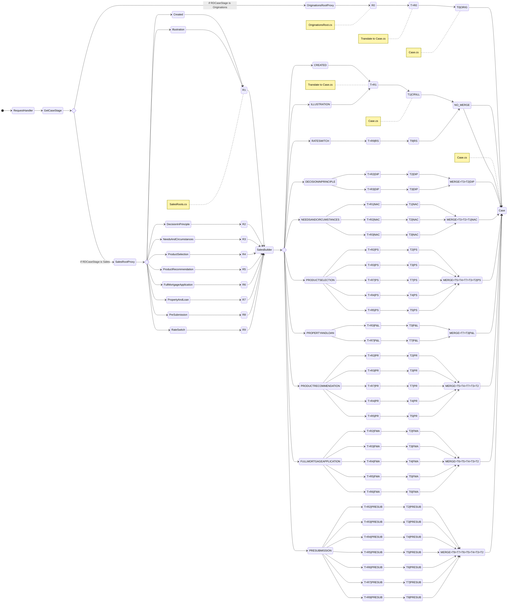

Foo

```mermaid
stateDiagram
    direction LR
    [*] --> RequestHandler
    RequestHandler --> GetCaseStage        
    GetCaseStage
    state sales_or_originations <<choice>>
    GetCaseStage --> sales_or_originations
    sales_or_originations --> SalesRootProxy: if RDCaseStage is Sales
    sales_or_originations --> OriginationsRootProxy: if RDCaseStage is Originations
    OriginationsRootProxy --> R0

    note left of R0
        OriginationsRoot.cs
    end note 

    
    R0 --> T>R0

    note left of T>R0
        Translate to Case.cs
    end note 

    

    T>R0 --> T0|ORIG

    note left of T0|ORIG
        Case.cs
    end note 

    T0|ORIG --> Case
    state sales_stage <<choice>>
    SalesRootProxy --> sales_stage
    sales_stage --> Created
    sales_stage --> Illustration
    sales_stage --> DecisionInPrinciple
    sales_stage --> NeedsAndCircumstances
    sales_stage --> ProductSelection
    sales_stage --> ProductRecommendation
    sales_stage --> FullMortgageApplication
    sales_stage --> PropertyAndLoan
    sales_stage --> PreSubmission
    sales_stage --> RateSwitch
    Created --> R1
    Illustration --> R1
    DecisionInPrinciple --> R2
    NeedsAndCircumstances --> R3
    ProductSelection --> R4
    ProductRecommendation --> R5
    FullMortgageApplication --> R6
    PropertyAndLoan --> R7
    PreSubmission --> R8
    RateSwitch --> R9
    R1 --> SalesBuilder
    R2 --> SalesBuilder
    R3 --> SalesBuilder
    R4 --> SalesBuilder
    R5 --> SalesBuilder
    R6 --> SalesBuilder
    R7 --> SalesBuilder
    R8 --> SalesBuilder
    R9 --> SalesBuilder
    note left of R1
        SalesRoots.cs
    end note
    state sales_stage2 <<choice>>
    SalesBuilder --> sales_stage2
    sales_stage2 --> CREATED
    sales_stage2 --> ILLUSTRATION
    sales_stage2 --> DECISIONINPRINCIPLE
    sales_stage2 --> NEEDSANDCIRCUMSTANCES
    sales_stage2 --> PRODUCTSELECTION
    sales_stage2 --> PRODUCTRECOMMENDATION
    sales_stage2 --> FULLMORTGAGEAPPLICATION
    sales_stage2 --> PROPERTYANDLOAN
    sales_stage2 --> PRESUBMISSION
    sales_stage2 --> RATESWITCH

    %% CREATED/ILLUSTRATION    
    CREATED --> T>R1

    note left of T>R1
        Translate to Case.cs
    end note 
    ILLUSTRATION --> T>R1
    T>R1 --> T1|CR\ILL
    note left of T1|CR\ILL
        Case.cs
    end note 
    T1|CR\ILL --> NO_MERGE
    NO_MERGE --> Case

    note left of Case
        Case.cs
    end note

    %% RATESWITCH
    RATESWITCH --> T>R9|RS
    T>R9|RS --> T9|RS
    T9|RS --> NO_MERGE
    NO_MERGE --> Case

    %% DECISIONINPRINCIPLE
    DECISIONINPRINCIPLE --> T>R2|DIP
    DECISIONINPRINCIPLE --> T>R3|DIP
    T>R2|DIP --> T2|DIP
    T>R3|DIP --> T3|DIP
    T2|DIP --> MERGE>T3>T2|DIP
    T3|DIP --> MERGE>T3>T2|DIP
    MERGE>T3>T2|DIP --> Case

    %% NEEDSANDCIRCUMSTANCES
    NEEDSANDCIRCUMSTANCES --> T>R1|NAC
    NEEDSANDCIRCUMSTANCES --> T>R2|NAC
    NEEDSANDCIRCUMSTANCES --> T>R3|NAC
    T>R1|NAC --> T1|NAC
    T>R2|NAC --> T2|NAC
    T>R3|NAC --> T3|NAC
    T1|NAC --> MERGE>T3>T2>T1|NAC
    T2|NAC --> MERGE>T3>T2>T1|NAC
    T3|NAC --> MERGE>T3>T2>T1|NAC
    MERGE>T3>T2>T1|NAC --> Case

    %% PRODUCTSELECTION
    PRODUCTSELECTION --> T>R2|PS
    PRODUCTSELECTION --> T>R3|PS
    PRODUCTSELECTION --> T>R7|PS
    PRODUCTSELECTION --> T>R4|PS
    PRODUCTSELECTION --> T>R5|PS
    T>R2|PS --> T2|PS
    T>R3|PS --> T3|PS
    T>R7|PS --> T7|PS
    T>R4|PS --> T4|PS
    T>R5|PS --> T5|PS
    T2|PS --> MERGE>T5>T4>T7>T3>T2|PS
    T3|PS --> MERGE>T5>T4>T7>T3>T2|PS
    T7|PS --> MERGE>T5>T4>T7>T3>T2|PS
    T4|PS --> MERGE>T5>T4>T7>T3>T2|PS
    T5|PS --> MERGE>T5>T4>T7>T3>T2|PS
    MERGE>T5>T4>T7>T3>T2|PS --> Case

    %% PROPERTYANDLOAN
    PROPERTYANDLOAN --> T>R3|P&L
    PROPERTYANDLOAN --> T>R7|P&L
    T>R3|P&L --> T3|P&L
    T>R7|P&L --> T7|P&L
    T3|P&L --> MERGE>T7>T3|P&L
    T7|P&L --> MERGE>T7>T3|P&L
    MERGE>T7>T3|P&L --> Case

    %% PRODUCTRECOMMENDATION
    PRODUCTRECOMMENDATION --> T>R2|PR
    PRODUCTRECOMMENDATION --> T>R3|PR
    PRODUCTRECOMMENDATION --> T>R7|PR
    PRODUCTRECOMMENDATION --> T>R4|PR
    PRODUCTRECOMMENDATION --> T>R5|PR
    T>R2|PR --> T2|PR
    T>R3|PR --> T3|PR
    T>R7|PR --> T7|PR
    T>R4|PR --> T4|PR
    T>R5|PR --> T5|PR
    T2|PR --> MERGE>T5>T4>T7>T3>T2
    T3|PR --> MERGE>T5>T4>T7>T3>T2
    T7|PR --> MERGE>T5>T4>T7>T3>T2
    T4|PR --> MERGE>T5>T4>T7>T3>T2
    T5|PR --> MERGE>T5>T4>T7>T3>T2
    MERGE>T5>T4>T7>T3>T2 --> Case

    %% FULLMORTGAGEAPPLICATION
    FULLMORTGAGEAPPLICATION --> T>R2|FMA
    FULLMORTGAGEAPPLICATION --> T>R3|FMA
    FULLMORTGAGEAPPLICATION --> T>R4|FMA
    FULLMORTGAGEAPPLICATION --> T>R5|FMA
    FULLMORTGAGEAPPLICATION --> T>R6|FMA
    T>R2|FMA --> T2|FMA
    T>R3|FMA --> T3|FMA
    T>R4|FMA --> T4|FMA
    T>R5|FMA --> T5|FMA
    T>R6|FMA --> T6|FMA
    T2|FMA --> MERGE>T6>T5>T4>T3>T2
    T3|FMA --> MERGE>T6>T5>T4>T3>T2
    T4|FMA --> MERGE>T6>T5>T4>T3>T2
    T5|FMA --> MERGE>T6>T5>T4>T3>T2
    T6|FMA --> MERGE>T6>T5>T4>T3>T2
    MERGE>T6>T5>T4>T3>T2 --> Case
    
    %% PRESUBMISSION
    PRESUBMISSION --> T>R2|PRESUB
    PRESUBMISSION --> T>R3|PRESUB
    PRESUBMISSION --> T>R4|PRESUB
    PRESUBMISSION --> T>R5|PRESUB
    PRESUBMISSION --> T>R6|PRESUB
    PRESUBMISSION --> T>R7|PRESUB
    PRESUBMISSION --> T>R9|PRESUB
    T>R2|PRESUB --> T2|PRESUB
    T>R3|PRESUB --> T3|PRESUB
    T>R4|PRESUB --> T4|PRESUB
    T>R5|PRESUB --> T5|PRESUB
    T>R6|PRESUB --> T6|PRESUB
    T>R7|PRESUB --> T7|PRESUB
    T>R9|PRESUB --> T9|PRESUB
    T2|PRESUB --> MERGE>T9>T7>T6>T5>T4>T3>T2
    T3|PRESUB --> MERGE>T9>T7>T6>T5>T4>T3>T2
    T4|PRESUB --> MERGE>T9>T7>T6>T5>T4>T3>T2
    T5|PRESUB --> MERGE>T9>T7>T6>T5>T4>T3>T2
    T6|PRESUB --> MERGE>T9>T7>T6>T5>T4>T3>T2
    T7|PRESUB --> MERGE>T9>T7>T6>T5>T4>T3>T2
    T9|PRESUB --> MERGE>T9>T7>T6>T5>T4>T3>T2
    MERGE>T9>T7>T6>T5>T4>T3>T2 --> Case  
    
```
